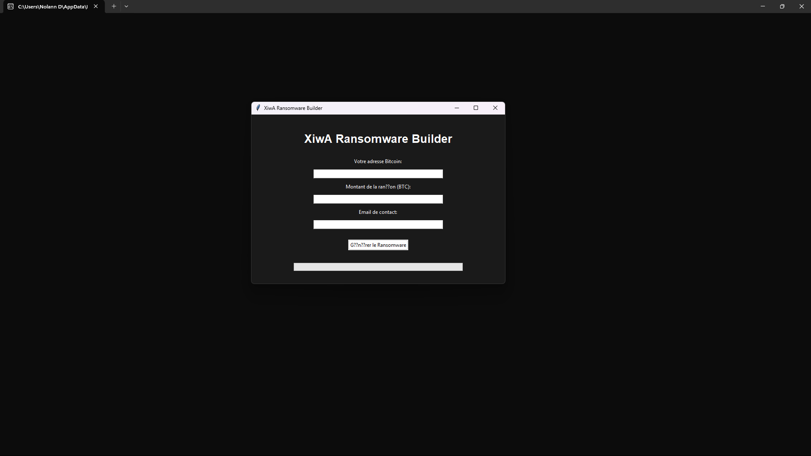
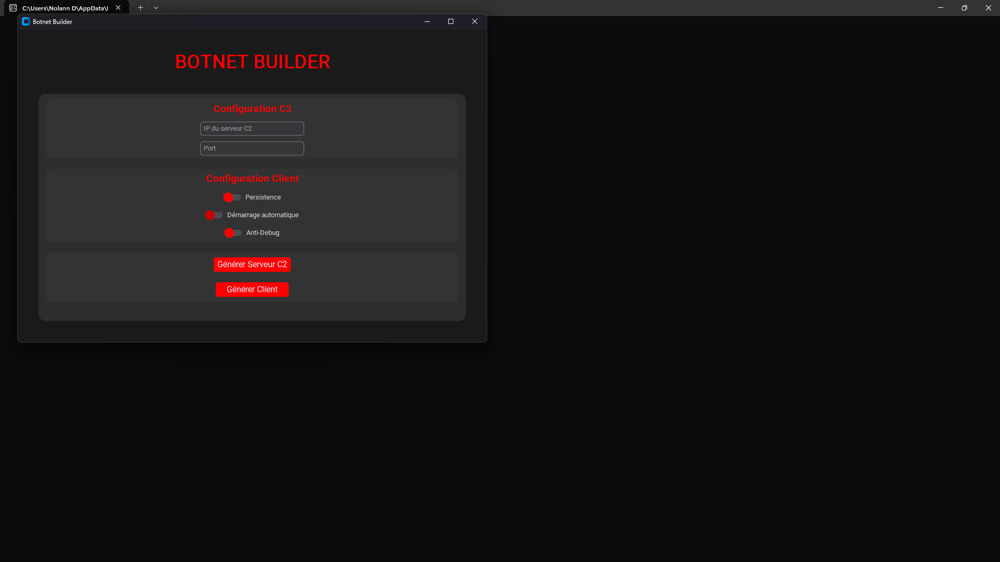

<!-- # XiwA Tool




## Features

```
┌── ⚒️ - OUTILS DE BASE
│   ├── Website Vulnerability Scanner
│   ├── Info Stealer
│   └── Brute Force
│
├── 💰 - OUTILS AVANCES
│   ├── Server Scanner
│   ├── Phone Locator
│   ├── Anonymization Software
│   └── Emoney Control
│
├── 🕵️‍♂️ - OUTILS DISCORD
│   ├── Webhook Spammer
│   ├── Token Checker
│   ├── Member Scraper
│   ├── Channel Nuker
│   ├── Member Trusser
│   ├── Propriety Transfert
│   ├── Server Nuker
│   ├── Discord Rat
│   ├── Token Grabber
│   ├── Nitro Auto Claim
│   ├── ID Lookup
│   ├── Vocal DDoS
│   ├── Bot Creator
│   ├── Mass Report
│   ├── Account Nuker
│   └── Discord Boost Bot
│
├── 🔎 - OSINT/CSINT
│   ├── Phone OSINT
│   ├── Email OSINT
│   ├── Username OSINT
│   └── IP OSINT
│
├── 🔧 - OSINT AVANCE
│   ├── Social Scanner
│   ├── Location Finder
│   ├── Data Aggregator
│   ├── Identity Search
│   └── Dox Creator
│
├── ☠️ - CYBERATTAQUE
│   ├── Botnet Builder
│   └── Ransomware Builder
│
└── 🎮 - HACKING
    ├── Network Scanner
    ├── Password Cracker
    ├── Exploit Framework
    ├── Data Base Site Stealer
    ├── Read Database
    └── PiratattHack
```

## Requirements

Windows:
- Python 3.8 ou supérieur
- Windows 10 ou supérieur

Linux:
- Python 3.8 ou supérieur
- Distribution Linux récente

## Installation

1. Téléchargez le fichier ZIP de XiwA Tool
2. Extrayez le contenu du dossier
3. Lancez `Setup.bat` ou `Setup.py`

Ou

1. Ouvrez un terminal
2. Exécutez `git clone https://github.com/dryzer0dev/XIWA-TOOL`
3. Exécutez `cd XiwA-Tool`
4. Exécutez `git pull`
5. Exécutez `python Setup.py`

## À Propos
XiwA Tool est une suite complète de sécurité et d'analyse développée par Dryz3R. Cette boîte à outils puissante combine plusieurs fonctionnalités essentielles pour l'analyse de sécurité et le test de vulnérabilités.

## Dépannage

- Si vous rencontrez des erreurs de dépendances :
  ```bash
  pip install --upgrade -r requirements.txt
  ```
- Pour les problèmes d'autorisation :
  ```bash
  chmod +x xiwa.py
  ``` -->

==============================
By Dryz3R
==============================

raison:
    - Harcèlement;
    - Agression;

délis:
    - Agression;
    - Harcèlement;
    - Drogue;
    
    Consequence prison.

-------------------------------

## tête:


age:
28 - 29

## Localisation:

# Pays
france

# Ville
Lorient

# situation
Celibataire

## Réseaux

Facebook: https://www.facebook.com/guillaumenicol2
Tiktok: lebgdu56100

### FAMILLE

mère: Anita
      Lehours